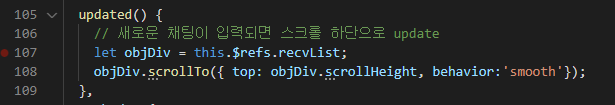

# 20220210

### 오늘의 할일 ✔

- [x] 채팅 스크롤 이슈 확인하고 해결하기
- [ ] 채팅 System 안내 메세지 구현
- [ ] 능력 Component 작성 


###  

### 채팅 스크롤 이슈 확인하고 해결하기 💬



GameChat.vue에서 채팅로그리스트인 recvList에 ref를 걸고 WebAPI인 scrollTo()기능과 scrollHeight()기능을 이용하여 채팅로그가 update 될 때마다 자동으로 밑으로 보이게끔 구현


###  

### 오늘의 느낀점 ✏

```
개발기간이 얼마 남지 않았는데 해결해야 될 문제가 생각보다 많아서 걱정이 된다. 
오늘은 어제 구현한 채팅 기능에 있어서 채팅로그가 쌓일 때마다 스크롤바가 자동으로 밑으로 배치될 수 있도록 하는 라이브러리를 찾아보고 구현하기로 했다. 
오늘 결국 자동스크롤을 해결은 하였지만 저 채팅창 스크롤 하나를 구현하기 위해 오늘 하루를 썼더니 너무 시간이 아깝고 앞으로 더 구현할 기능들이 조금 막막했다. 
다음주까지 프로젝트를 완성할 수 있을지 걱정된다.
```

